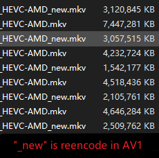

# Vedio Encode Config of StaxRip

Contains HEVC AVC AV1 and the hardcoded of HEVC AVC

Personally think that the biggest role is to use AV1 to encode video to save space for storing video

The following are the configuration files for each decoding type

## HEVC - (Currently only includes hardware encoding)

- AMD_HDRtoSDR_1080P_DecodeVCC.srip
  - Function: Convert HDR to SDR
  - Output: 10bit SDR HEVC MKV

## AV1 - (**Contains software** code only)

> **Reference encoding speed INFO**
>
> Encoding CPU : Intel XEON E-2176M (Keep Running On 4.0Ghz) (CPU-Z score 3500+) 
>
> Coding 4K : 26FPS

- SVT-AV1 (Suitable for desktop recording)

  > Generally **50%** of the space occupied by *AMD HEVC from OBS (CQP 26)*
  >
  > 
  >
  > SVT-AV1_MF_31_ScreenDect_4K_BT.709-TO-BT.709
  >
  > SVT-AV1_MF_31_ScreenDect_1080P_BT.709-TO-BT.709
  >
  > SVT-AV1_MF_31_ScreenDect_2880_BT.709-TO-BT.709

  - Function: video archive
  - Output: 8bit SDR AV1 MKV